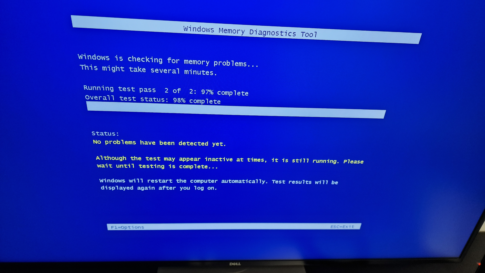
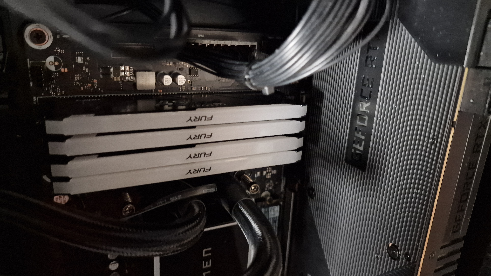
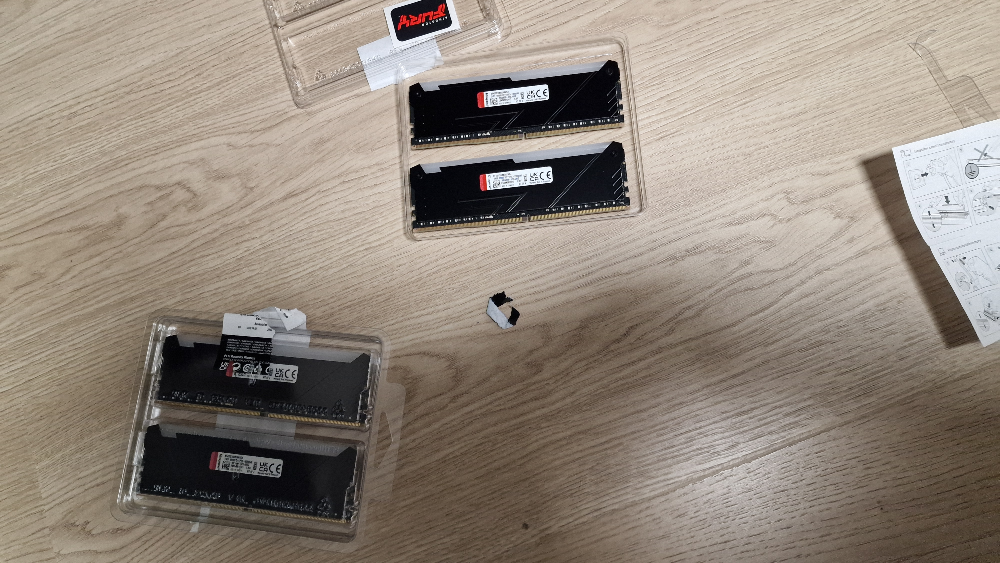
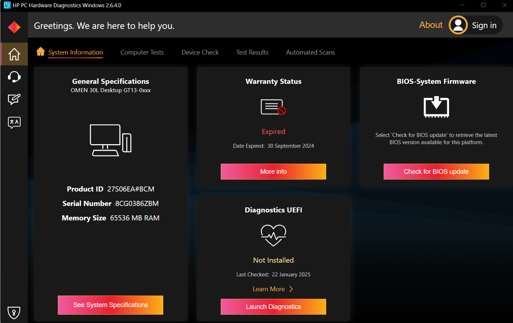
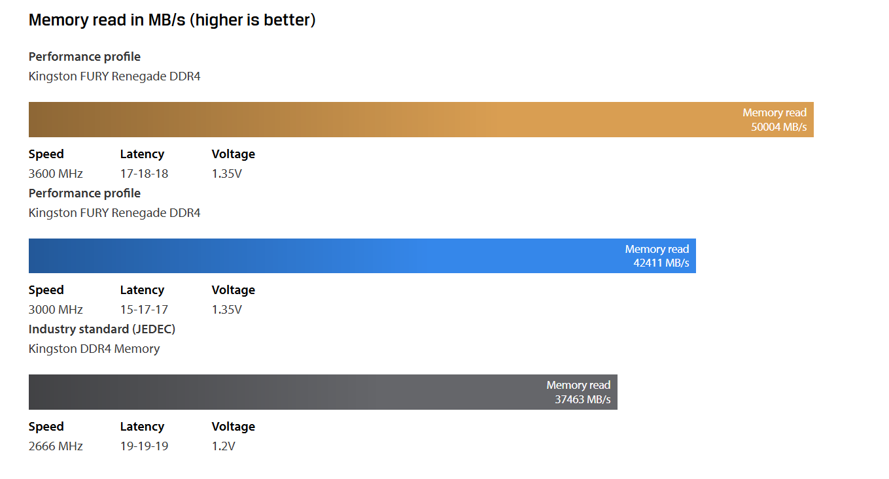
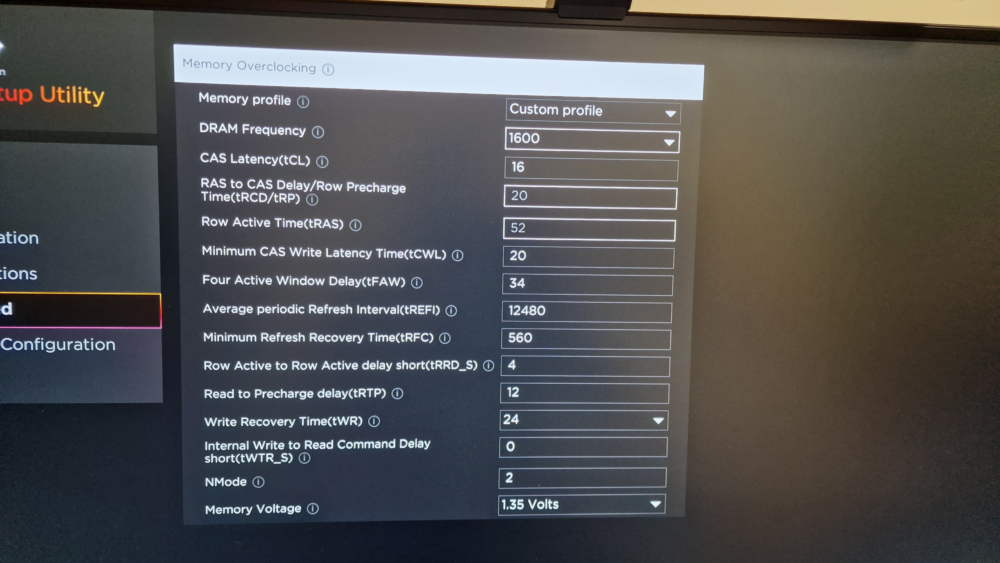
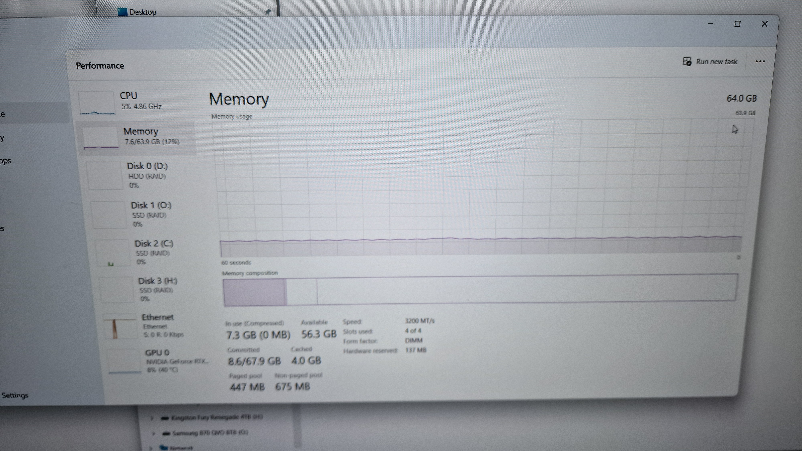
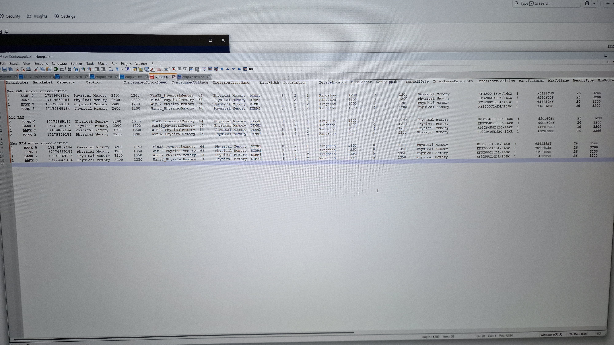

# ram

This page contains info about RAM, overclocking RAM.

## RAM

Get ram status
`wmic memorychip get > outpuit.txt`


The result is
```
Attributes  BankLabel  Capacity     Caption          ConfiguredClockSpeed  ConfiguredVoltage  CreationClassName     DataWidth  Description      DeviceLocator  FormFactor  HotSwappable  InstallDate  InterleaveDataDepth  InterleavePosition  Manufacturer  MaxVoltage  MemoryType  MinVoltage  Model  Name             OtherIdentifyingInfo  PartNumber         PositionInRow  PoweredOn  Removable  Replaceable  SerialNumber  SKU  SMBIOSMemoryType  Speed  Status  Tag                TotalWidth  TypeDetail  Version  
2           BANK 0     17179869184  Physical Memory  3200                  1200               Win32_PhysicalMemory  64         Physical Memory  DIMM1          8                                      2                    1                   Kingston      1200        0           1200               Physical Memory                        HP32D4U8D8HC-16XR  1                                                 52CD60B4           26                3200           Physical Memory 0  64          128                  
2           BANK 1     17179869184  Physical Memory  3200                  1200               Win32_PhysicalMemory  64         Physical Memory  DIMM2          8                                      2                    1                   Kingston      1200        0           1200               Physical Memory                        HP32D4U8D8HC-16XR  1                                                 50CD60B6           26                3200           Physical Memory 1  64          128                  
2           BANK 2     17179869184  Physical Memory  3200                  1200               Win32_PhysicalMemory  64         Physical Memory  DIMM3          8                                      2                    2                   Kingston      1200        0           1200               Physical Memory                        HP32D4U8D8HC-16XR  1                                                 4FCE196D           26                3200           Physical Memory 2  64          128                  
2           BANK 3     17179869184  Physical Memory  3200                  1200               Win32_PhysicalMemory  64         Physical Memory  DIMM4          8                                      2                    2                   Kingston      1200        0           1200               Physical Memory                        HP32D4U8D8HC-16XR  1                                                 4ECD7BDD           26                3200           Physical Memory 3  64          128                  

```

### Windows RAM diagnostic
Run terminal as administrator
Run command
`mdsched`
After PC reboots, it will run memory tests.



If the test has errors, for example hardware failures, consider removing |RAM sticks one by one to find out if the problem is with the RAM stick or with the motherboard.
If the problem is with RAM, replace all RAM sticks to ensure that the RAM set is in sync.

I had a RAM failure, I had to remove all RAM sticks and insert just one. 



Run the test from above. The RAM stick was OK, so I added another one.
And finally, one stick started to fail the tests.
I had to make sure that it is RAM stick failure, not the motherboard. So I moved this failing stick to another slot.
The test failed again.
I bought new RAM sticks compatible with my motherboard.

In my case, it is
```
PC motherboard
HP name: Dorado OC-AMP
SSID: 8703
https://support.hp.com/us-en/document/c06937349
```

It supports 8 or 16 GB RAM DDR4 sticks with the frequencies up to 3200 MT/s.



After I installed new RAM sticks, I found out that their speed was at 2400 MT/s instead of 3200.
You can find it in Task Manager. I had to overclock RAM, see the next section.

## RAM overclocking
I used Kingston Fury Beast DDR4 RAM.
https://www.kingston.com/en/memory/gaming/kingston-fury-beast-ddr4-memory

It has XMP (extended memory profiles) technology.

https://www.kingston.com/en/memory/gaming/overclocking-education

I had to update BIOS and reset CMOS to make sure that my BIOS supports them.
Warning, updated BIOS my also have issues with XMP. I was lucky though.

I downloaded it from
https://support.hp.com/si-en/document/ish_9767626-9767684-16

I used the tool HP PC Hardware Diagnostics Windows

I clicked "Check for BIOS update". 

Later, I also found this link
https://support.hp.com/us-en/drivers/swdetails/omen-desktop-pc-30l-gt13-0000i/model/2100180165/swItemId/cp-330454-1

**Reset CMOS**

I pressed power button for 20 seconds.
https://support.hp.com/my-en/document/ish_11469889-11469938-16

Now I could start overclocking.

It had some memory profiles. For example

But these settings did not work for me.

I started with these values:


Each time, when I changed some value, I would try to start my PC, and it would fail, making some noise.
After the failure, memory settings would be reset to defaults.

And finally, I had these settings:



Please note
 **DRAM Frequency** has value 1600, but in the reality, it will be doubled.

#### Result


And this is the result of RAM status
